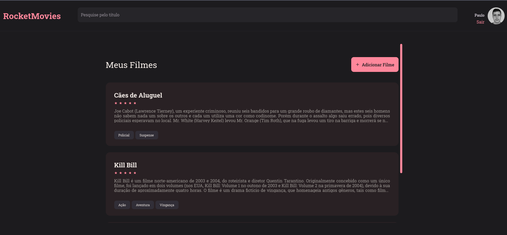
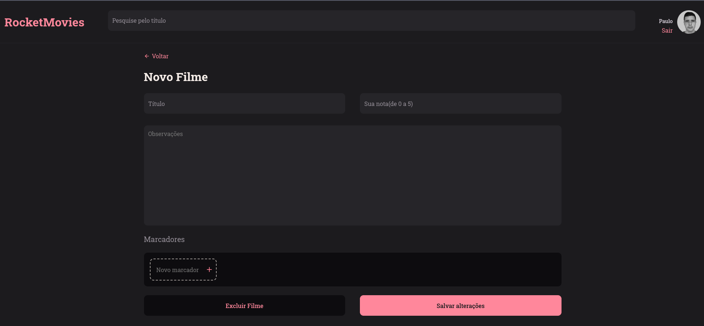
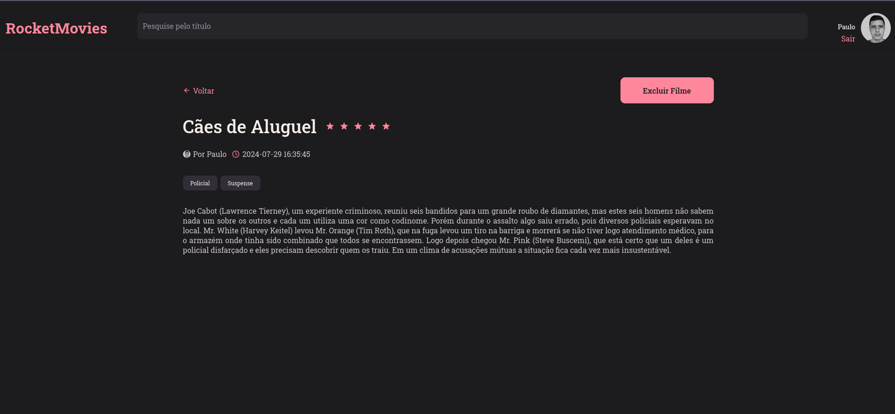
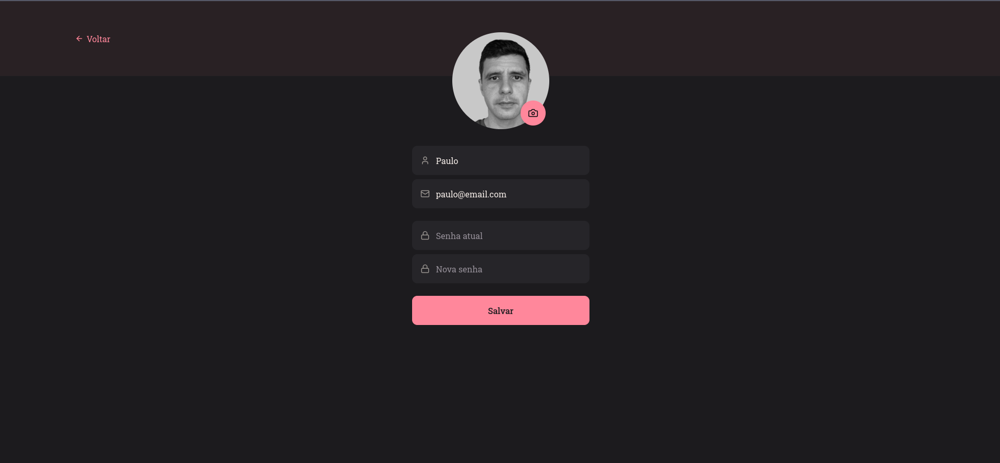

<h1 align="center">🎥 RocketMovies </h1>


## 📁 Projeto

- Frontend do projeto RocketMovies, sua aplicação para acompanhar tudo que assistir!

## 📃 Páginas

- A aplicação conta com páginas de login, cadastro, visualizar filme, perfil e cadastrar filme.

<div>
  
  
  
  
</div>


## 🛠️ Funcionalidades

- Login;
- Cadastro;
- Mostrar perfil;
- Atualizar perfil;
- Alterar avatar;
- Cadastrar filmes;
- Mostrar filmes cadastradas;
- Filtrar filmes;
- Mostrar detalhes do filme;
- Excluir filme;
- Logout.

## 🚀 Tecnologias

Este projeto foi desenvolvido com as seguintes tecnologias:

- ViteJS;
- ReactJS;
- Styled Components;
- React Icons;
- React Router;
- Axios.

## Rodando o Projeto

```
$ git clone https://github.com/pcaldi/rocket-movies
$ cd rocket-movies
$ npm install
$ npm run dev
```

---

