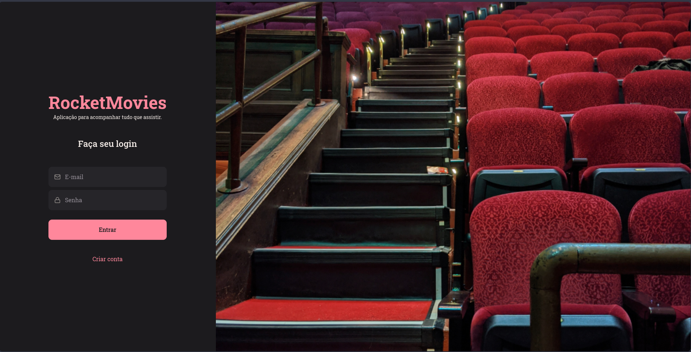
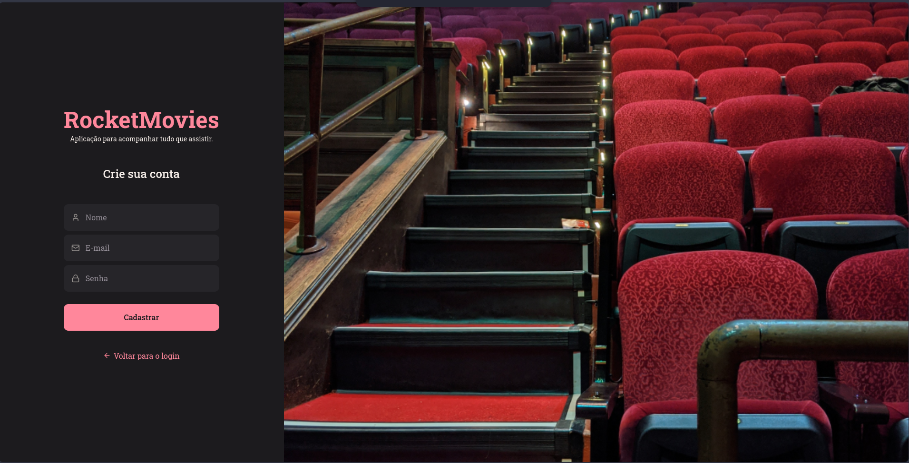

<h1 align="center">🎥 RocketMovies </h1>


## 📁 Projeto

- Frontend do projeto RocketMovies, sua aplicação para acompanhar tudo que assistir!

## 📃 Páginas

- A aplicação conta com páginas de login, cadastro, visualizar filme, perfil e cadastrar filme.

<div align="center">
  
  
  
  
  
  
</div>

## ⭐ Site

A aplicação RocketMovies está disponível para utilização [aqui](https://pcaldirocketmovie.netlify.app/).

## 🛠️ Funcionalidades

- Login;
- Cadastro;
- Mostrar perfil;
- Atualizar perfil;
- Alterar avatar;
- Cadastrar filmes;
- Mostrar filmes cadastradas;
- Filtrar filmes;
- Mostrar detalhes do filme;
- Excluir filme;
- Logout;

## 🚀 Tecnologias

Este projeto foi desenvolvido com as seguintes tecnologias:

- ViteJS;
- ReactJS;
- Styled Components;
- React Icons;
- React Router;

## 🎡 Rodando o projeto localmente

```
$ git clone https://github.com/pcaldi/rocket-movies
$ cd rocket-movies
$ npm install
$ npm run dev
```
## 👨🏻‍💻 Autor

<a href="https://github.com/pcaldi">
 
 <br />
 <sub><b>Paulo Caldi</b></sub></a> <a href="https://github.com/pcaldi" title="emoji">🙋🏻</a>
 <br />

[](https://www.linkedin.com/in/pcaldi/)
[](mailto:pcaldi@gmail.com)


---
